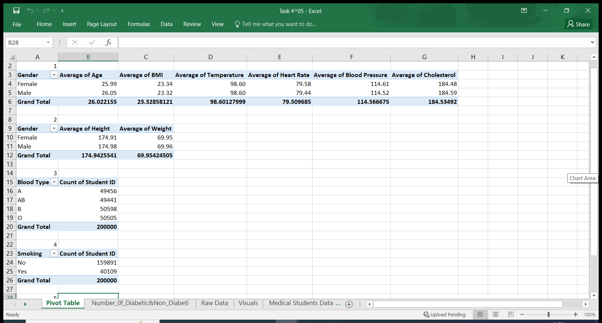

# Introduction
In continuation of the 3rd Data Analytics Cohort facilitated by Promise Nonso, a data analytics Coach. She gave us the following tasks after the final Excel session of the boot camp.  These tasks test our understanding and know-how of the workings of the Pivot Table and Data Visualization using Pivot Chart. We are provided with a raw dataset of medical students' vitals at the University Health Centre. This dataset has 200,000 rows and 13 columns namely; _Student ID, Age, Gender, Height, Weight, Blood Type, BMI, Temperature, Heart Rate, Blood Pressure, Cholesterol, Diabetes, and Smoking columns_.

## Tasks
Create Pivot Tables showing the following:
- Average values for the male's and female’s _Age, BMI, Temperature, Heart Rate, Blood Pressure, and Cholesterol_
- Average _Height and Weight_ for both Genders (in 2 decimal places)
- Number of students across the different _Blood Groups_
- Number of Students who smoke and those who don’t
- Number of Students who have diabetes and those who don’t

## Skills Demonstrated
- Data cleaning 
- Use of Pivot table
- Data visualization of the pivot table using pivot charts

## Data Cleaning
The raw dataset was full of blank cells on all columns, which I filled with the average value of each column calculated except the _Student ID_, which I filled with the Flash Fill button, because of the serial nature of the numbering. _Gender_, which I populated the blank cells using Find and Select command, via the Go To Special box, replicating the immediate data for the blank cells. And the _Blood Type, Diabetes, and Smoking_ columns were filled up the same as the _Gender_ columns. Thus, producing a cleaned dataset for our analysis, see the said dataset under this raw dataset.

## Activity 1 
 Getting the average values for both sexes Age, BMI, Temperature, Heart Rate, Blood Pressure, and Cholesterol required creating a pivot table. I placed my cursor on a cell, then clicked Insert on top of the Excel ribbon, clicked on Pivot Table, the box popped up on the dataset, automatically the range in review loaded on the box, then I checked the New Worksheet to take me to a new sheet where my calculations will be done. On the new sheet, named “Pivot Table’’ the pivot table field box appeared on the right-hand side. I dragged Gender into the ROWS section and _Age, BMI, Temperature, Heart Rate, Blood Pressure, and Cholesterol_ respectively were dragged into the VALUES section of the pivot table fields, which automatically showed the summation of the six sections. To get the average values of all, I double-clicked each column's header to go to the Value Field Setting, where I changed the default Sum value to average to arrive at the average values of all.
 
 

## Activity 2 
Getting the average Height and Weight of the male and female students with the use of the pivot table. Going through the same process as above, then clicking Insert on top of the Excel ribbon, and clicking on Pivot Table, the box popped up on the dataset, and automatically the range in review loaded on the box, I now checked the Existing Worksheet to take me to the sheet named ‘’pivot table’’ where my calculations will be done. On the “pivot table’’ sheet, the pivot table field box appeared on the right-hand side. I dragged Gender into the row section and height and weight into the values section, which automatically produced a summation of the height and weight in the respective columns. I double-clicked each column to access the Value Field Setting, from where I changed the default ’sum’ value to average. The average values were highlighted, then I reduced the values to 2 decimal places by clicking on the ‘decrease decimal’ arrow on the ‘Home’ on the ribbon. 

## Activity 3,4, and 5
For the last three activities of this task, the process is the same, being that we are required to get the number of students across blood types, those who smoke and those who do not, those who are diabetic and those who are not. I inserted the pivot table, dragged the Blood Type, to the ROW section, and Student ID into the VALUES section, producing a pivot table with the default summation, I changed the sum to count in the value field setting box, hence, this gave me the number of students across blood types. 
Same for Activity 4, I inserted the pivot table, dragged the Smoking field, to the ROW section, and Student ID into the VALUES section, producing a pivot table with the default summation, I changed the sum to count in the value field setting box, hence, this gave me the number of students who smoke and those that do not. 
Sane for the last activity, I inserted the pivot table, dragged the Diabetes field, to the ROW section, and the StudentID field into the VALUES section, producing a pivot table with the default summation, I changed the sum to count in the value field setting box, hence, this gave me the number of students who are diabetic and those who are not. 

## Tassk 5
## REPORTS

# Data Visualization of The Pivot Table Using Pivot Chart

Visual reports of the Pivot Tables using Pivot Charts

## Conclusion
These tasks have added to my knowledge bank of the understanding and know-how of Excel as a tool for data analytics. I'm glad about this milestone. More grounds to gain. Thank you

